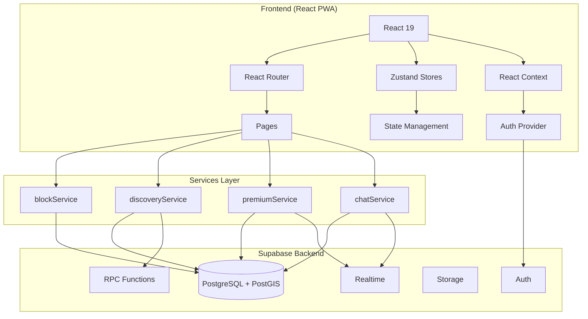
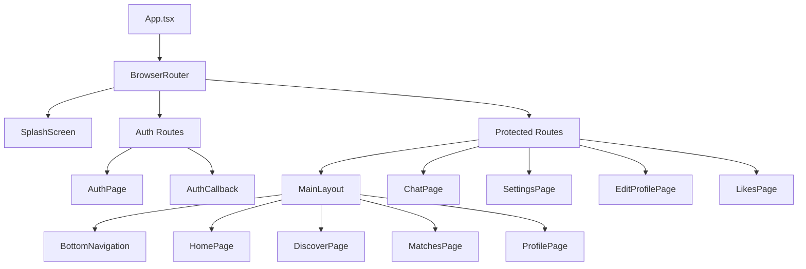
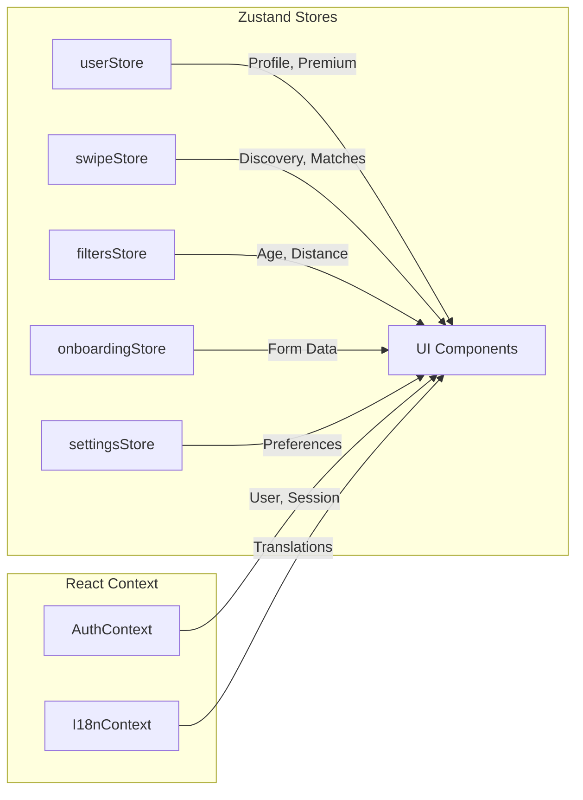
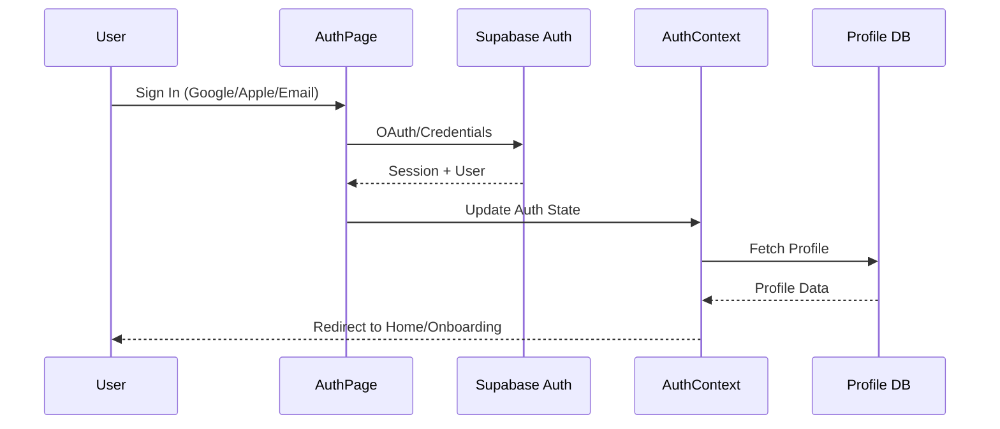
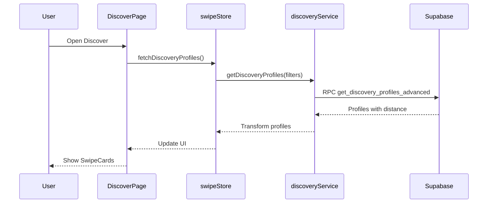
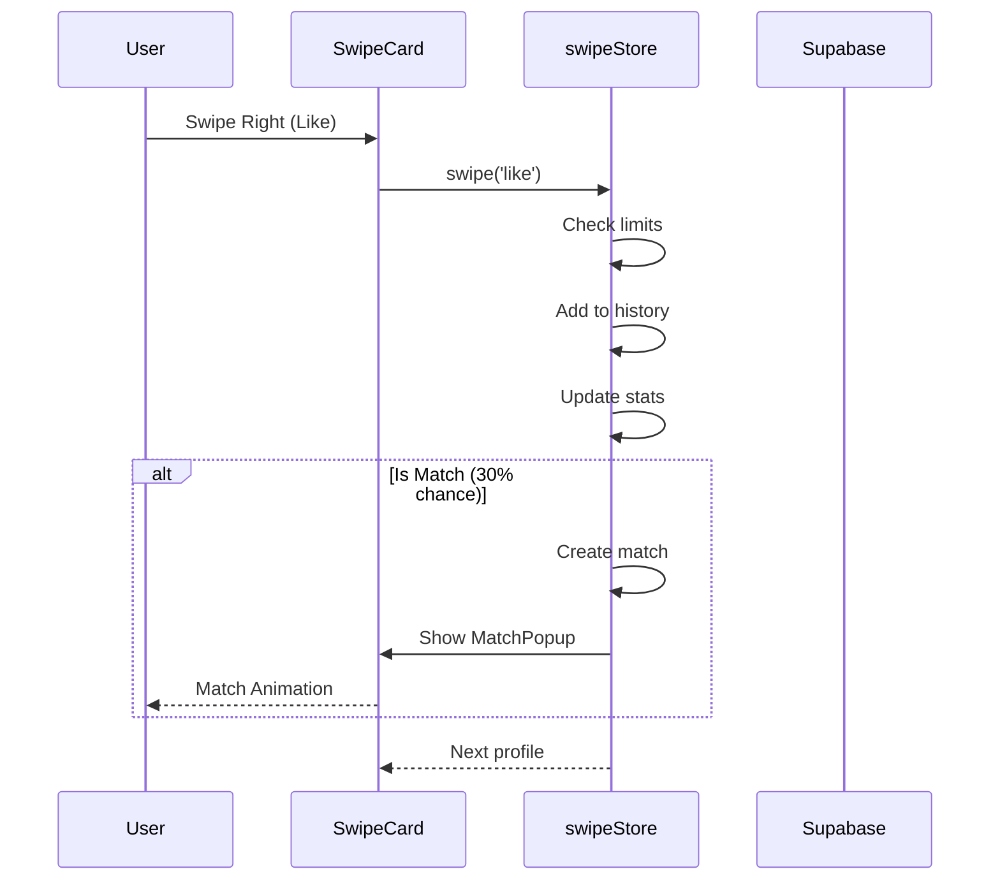
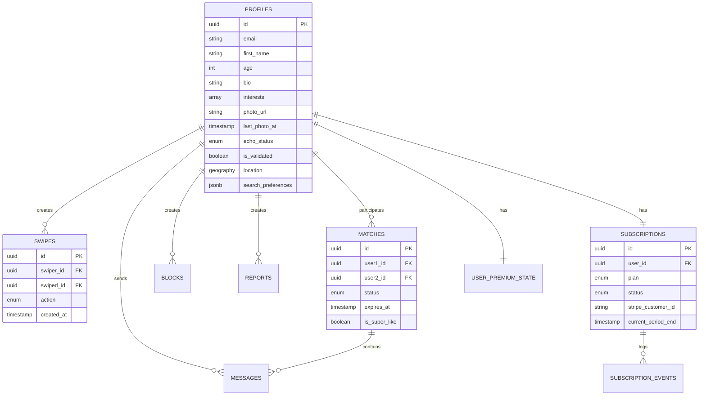
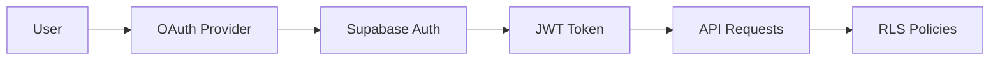
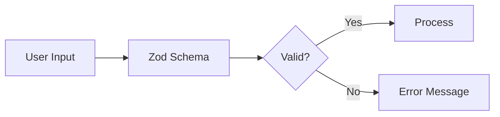
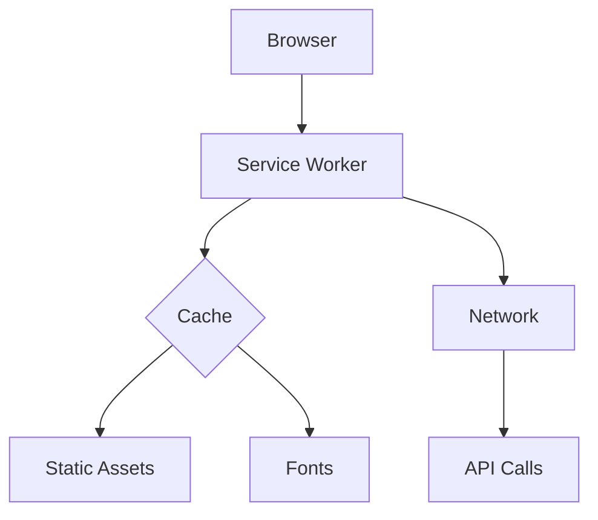

# Architecture Documentation

## System Overview

Echo follows a modern frontend-first architecture with Supabase as the Backend-as-a-Service (BaaS). The application is built as a Progressive Web App (PWA) with offline capabilities.



## Frontend Architecture

### Component Hierarchy



### State Management

Echo uses a hybrid approach combining Zustand for global state and React Context for auth:



#### Store Details

| Store | Purpose | Persistence |
|-------|---------|-------------|
| `userStore` | User profile, echo status, premium state | localStorage |
| `swipeStore` | Discovery profiles, matches, limits, stats | localStorage |
| `filtersStore` | Search filters (age, distance, gender) | localStorage |
| `onboardingStore` | Onboarding form data | localStorage |
| `settingsStore` | App preferences, notifications | localStorage |

### Routing Architecture

```typescript
// Route Protection Hierarchy
/auth              // Public only (redirects if authenticated)
/auth/callback     // OAuth callback handler
/onboarding        // Requires auth, no completed profile
/                  // Protected + completed onboarding
/discover          // Protected + completed onboarding
/matches           // Protected + completed onboarding
/profile           // Protected + completed onboarding
/chat/:matchId     // Protected + completed onboarding
/settings/*        // Protected + completed onboarding
/wingman/:token    // Public (external validation link)
```

## Data Flow

### Authentication Flow



### Discovery Flow



### Swipe & Match Flow



## Database Schema

### Entity Relationship Diagram



### Key Tables

| Table | Description |
|-------|-------------|
| `profiles` | User profiles with location (PostGIS) |
| `swipes` | Swipe actions (like, nope, superlike) |
| `matches` | Mutual likes with expiration |
| `messages` | Chat messages |
| `blocks` | User blocks |
| `reports` | Content reports |
| `subscriptions` | Premium subscriptions |
| `premium_features` | Feature limits by plan |
| `user_premium_state` | Cached premium state |

## Design Patterns

### 1. Service Layer Pattern

All backend interactions go through typed service modules:

```typescript
// services/blockService.ts
export const blockUser = async (userId: string): Promise<BlockServiceResult> => {
  // Rate limit check
  // Auth check
  // Database operation
  // Error handling
}
```

### 2. Store Pattern (Zustand)

Centralized state with persistence:

```typescript
// stores/userStore.ts
export const useUserStore = create<UserState>()(
  persist(
    (set, get) => ({
      profile: null,
      setProfile: (profile) => set({ profile }),
      // Actions with computed updates
    }),
    { name: 'echo-user-storage' }
  )
)
```

### 3. Protected Route Pattern

Route guards for authentication and onboarding:

```typescript
function PrivateRoute({ children }) {
  const { isAuthenticated, hasCompletedOnboarding } = useAuth()

  if (!isAuthenticated) return <Navigate to="/auth" />
  if (!hasCompletedOnboarding) return <Navigate to="/onboarding" />

  return children
}
```

### 4. Optimistic Updates

UI updates before server confirmation:

```typescript
const swipe = (action) => {
  // Immediately update UI
  set(state => ({ currentIndex: state.currentIndex + 1 }))

  // Then sync to server (async)
  syncSwipeToServer(action)
}
```

### 5. Rate Limiting Pattern

Client + server-side rate limiting:

```typescript
// Client-side (UX)
if (!checkRateLimit('block-user', 20, 60 * 60 * 1000)) {
  return { error: 'Rate limit reached' }
}

// Server-side (Security) - via database triggers
```

## Security Architecture

### Authentication



### Row Level Security (RLS)

All tables have RLS policies:

```sql
-- Users can only see unblocked profiles
CREATE POLICY "Users can view unblocked profiles" ON profiles
  FOR SELECT USING (
    NOT EXISTS (
      SELECT 1 FROM blocks
      WHERE blocker_id = auth.uid() AND blocked_id = profiles.id
    )
  );
```

### Input Validation



## Performance Optimizations

### 1. Code Splitting

```typescript
// Lazy load pages
const HomePage = lazy(() => import('@/pages/Home'))
const DiscoverPage = lazy(() => import('@/pages/Discover'))
```

### 2. Chunk Optimization

```typescript
// vite.config.ts
manualChunks: {
  'vendor-react': ['react', 'react-dom', 'react-router-dom'],
  'vendor-motion': ['framer-motion'],
  'vendor-supabase': ['@supabase/supabase-js'],
}
```

### 3. State Persistence

```typescript
// Persist essential state to localStorage
partialize: (state) => ({
  profile: state.profile,
  isPremium: state.isPremium,
})
```

### 4. PostGIS for Geospatial Queries

```sql
-- Spatial index for fast distance queries
CREATE INDEX profiles_location_idx ON profiles
  USING GIST (location);
```

## PWA Architecture



### Caching Strategy

| Resource | Strategy | TTL |
|----------|----------|-----|
| Static assets | Cache First | 1 year |
| Fonts | Cache First | 1 year |
| API calls | Network First | - |
| Service Worker | No Cache | - |

## Technology Decisions

| Decision | Rationale |
|----------|-----------|
| **React 19** | Latest features, concurrent rendering |
| **Zustand** | Simple, performant, TypeScript-first |
| **Supabase** | Auth + DB + Realtime in one, PostgreSQL power |
| **PostGIS** | Native geospatial queries, efficient indexing |
| **Vite** | Fast HMR, modern build tooling |
| **Framer Motion** | Declarative animations, gesture support |

---

*See [ARCHITECTURE_DECISIONS.md](./ARCHITECTURE_DECISIONS.md) for detailed ADRs.*
