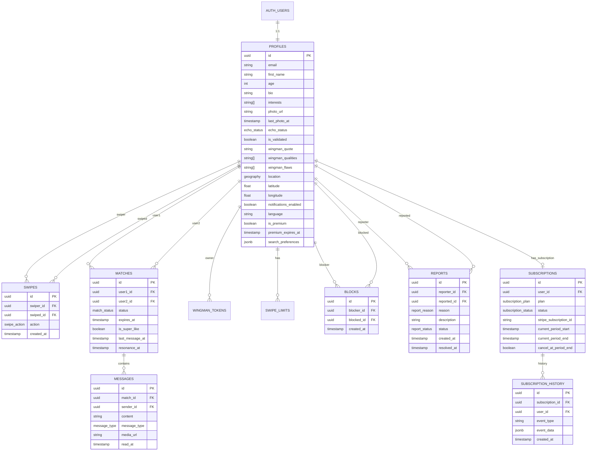

# Architecture Decisions Record - Echo Dating App

> Document genere le 21 janvier 2026
> Version: 1.0.0

## Table des Matieres

1. [Etat Actuel du Schema](#1-etat-actuel-du-schema)
2. [Analyse des Features](#2-analyse-des-features)
3. [Recommandations d'Architecture](#3-recommandations-darchitecture)
4. [Migrations Proposees](#4-migrations-proposees)
5. [Diagramme des Relations](#5-diagramme-des-relations)

---

## 1. Etat Actuel du Schema

### 1.1 Tables Existantes

| Table | Description | Colonnes Cles |
|-------|-------------|---------------|
| `profiles` | Profils utilisateurs | id, email, first_name, age, photo_url, echo_status, is_premium |
| `wingman_tokens` | Tokens de validation Wingman | token, user_id, expires_at, used_at |
| `swipes` | Actions de swipe | swiper_id, swiped_id, action (like/nope/superlike) |
| `matches` | Correspondances mutuelles | user1_id, user2_id, status, expires_at |
| `messages` | Messages dans les conversations | match_id, sender_id, content, message_type |
| `swipe_limits` | Limites journalieres de swipes | user_id, date, swipes_used, super_likes_used |

### 1.2 Enums Definis

```sql
echo_status: 'ACTIVE' | 'EXPIRING' | 'SILENCE'
match_status: 'pending' | 'matched' | 'expired' | 'resonance'
swipe_action: 'like' | 'nope' | 'superlike'
message_type: 'text' | 'image' | 'audio'
```

### 1.3 Fonctions SQL Existantes

| Fonction | Description |
|----------|-------------|
| `calculate_echo_status()` | Calcule le statut Echo basé sur last_photo_at |
| `check_match()` | Verifie si un match mutuel existe |
| `get_discovery_profiles()` | Recupere les profils pour le discovery |
| `calculate_distance()` | Calcule la distance Haversine entre 2 points |
| `create_match_on_like()` | Trigger: cree un match sur like mutuel |
| `expire_matches()` | Expire les matches apres 48h |

### 1.4 Extensions Activees

- `uuid-ossp` - Generation UUIDs
- `postgis` - Geolocalisation (presente mais non utilisee)

### 1.5 Index de Performance

```sql
idx_profiles_echo_status     -- Filtrage par statut
idx_profiles_location        -- Filtrage geographique (lat/lon)
idx_swipes_swiper/swiped     -- Recherche de swipes
idx_matches_users/status     -- Recherche de matches
idx_messages_match/created   -- Messages par conversation
idx_wingman_token            -- Recherche de tokens
```

---

## 2. Analyse des Features

### 2.1 Features Supportees

| Feature | Status | Implementation |
|---------|--------|----------------|
| Creation de profil | OK | Table `profiles` |
| Systeme Echo TTL (7 jours) | OK | Trigger `calculate_echo_status` |
| Swipes (like/nope/superlike) | OK | Table `swipes` + limites |
| Matching mutuel | OK | Trigger `create_match_on_like` |
| Messages temps reel | OK | Table `messages` + Realtime |
| Validation Wingman | OK | Table `wingman_tokens` |
| Limites de swipes | OK | Table `swipe_limits` |
| Flag Premium | PARTIEL | Colonne `is_premium` existe |

### 2.2 Features NON Supportees (Gaps)

| Feature | Status | Impact |
|---------|--------|--------|
| **Block/Report** | MANQUANT | Securite critique |
| **Likes recus** | MANQUANT | Page /likes non fonctionnelle |
| **Subscriptions Premium** | MANQUANT | Pas de gestion d'abonnements |
| **Filtrage par distance** | PARTIEL | PostGIS present mais pas de fonction optimisee |
| **Preferences de recherche** | MANQUANT | Age min/max, distance max non stockes |
| **Historique des achats** | MANQUANT | Pas de table transactions |

---

## 3. Recommandations d'Architecture

### 3.1 Decision: Systeme de Blocage/Signalement

#### Contexte
Les utilisateurs doivent pouvoir bloquer et signaler d'autres utilisateurs pour leur securite.

#### Options Evaluees

| Option | Avantages | Inconvenients |
|--------|-----------|---------------|
| A. Table unique `user_actions` | Simple, extensible | Queries complexes |
| B. Tables separees `blocks` + `reports` | Clair, RLS simple | Deux tables a maintenir |
| C. Colonne JSONB sur profiles | Pas de jointure | Pas d'index, pas scalable |

#### Decision
**Option B** - Tables separees `blocks` et `reports`

#### Raisons
- Separation of concerns claire
- RLS policies simples a implementer
- Index efficaces sur chaque table
- Reports necessitent des metadonnees differentes (raison, description)

### 3.2 Decision: Gestion Premium/Subscriptions

#### Contexte
Le flag `is_premium` existe mais sans gestion d'abonnements.

#### Options Evaluees

| Option | Avantages | Inconvenients |
|--------|-----------|---------------|
| A. Utiliser un service externe (Stripe Billing) | Gestion complete | Dependance externe |
| B. Table locale `subscriptions` | Controle total | Logique paiement a implementer |
| C. Hybride: Table locale + Webhooks Stripe | Best of both | Plus complexe |

#### Decision
**Option C** - Hybride avec table `subscriptions` synchronisee via webhooks

#### Raisons
- Stripe gere la logique de paiement complexe
- Table locale permet les queries Supabase natives
- RLS sur les features premium
- Historique des transactions local

### 3.3 Decision: Geolocalisation Optimisee

#### Contexte
PostGIS est installe mais la fonction `calculate_distance` utilise Haversine en PL/pgSQL.

#### Options Evaluees

| Option | Avantages | Inconvenients |
|--------|-----------|---------------|
| A. Garder Haversine PL/pgSQL | Simple, fonctionne | Lent sur gros volumes |
| B. Utiliser PostGIS ST_Distance | Optimise, index spatiaux | Requiert colonne geometry |
| C. Index GiST sur lat/lon | Compromis | Moins precis que PostGIS |

#### Decision
**Option B** - Migration vers PostGIS natif avec colonne `location` de type `geography`

#### Raisons
- PostGIS est deja installe
- Index spatiaux GiST pour performances
- Fonction `ST_DWithin` pour filtrage par rayon
- Support futur pour zones geographiques complexes

### 3.4 Decision: Voir qui m'a like

#### Contexte
Feature Premium "See who likes you" necessite de stocker les likes recus de maniere accessible.

#### Implementation
- Pas de nouvelle table necessaire
- La table `swipes` contient deja cette information
- Creer une **View** ou **Function** pour recuperer les likes recus
- Ajouter une RLS policy conditionnelle sur `is_premium`

---

## 4. Migrations Proposees

### 4.1 Migration 001: Blocks & Reports

Fichier: `supabase/migrations/001_add_blocks_reports.sql`

**Tables creees:**
- `blocks` - Utilisateurs bloques
- `reports` - Signalements

**Impact:**
- Modifier `get_discovery_profiles()` pour exclure les bloques
- Ajouter RLS policies

### 4.2 Migration 002: Premium & Subscriptions

Fichier: `supabase/migrations/002_add_premium_subscriptions.sql`

**Tables creees:**
- `subscriptions` - Abonnements actifs
- `subscription_history` - Historique des transactions
- `premium_features` - Configuration des features par plan

**Impact:**
- Trigger pour synchroniser `profiles.is_premium`
- Function pour verifier les features premium

### 4.3 Migration 003: Geolocalisation Avancee

Fichier: `supabase/migrations/003_add_geolocation.sql`

**Modifications:**
- Ajouter colonne `location` (geography) sur `profiles`
- Creer index GiST spatial
- Nouvelle fonction `get_profiles_within_distance()`
- Ajouter `search_preferences` sur profiles

**Impact:**
- Migration des donnees lat/lon existantes
- Mise a jour de `get_discovery_profiles()`

### 4.4 Migration 004: Likes Recus (View)

Fichier: `supabase/migrations/004_add_received_likes.sql`

**Creations:**
- View `received_likes` - Aggrege les likes recus
- Function `get_received_likes()` - Avec pagination
- RLS policy Premium-only

---

## 5. Diagramme des Relations



---

## 6. Architecture Frontend (Stores Zustand)

### 6.1 Stores Actuels

| Store | Responsabilite | Persistence |
|-------|----------------|-------------|
| `userStore` | Profil utilisateur, auth state | Oui (localStorage) |
| `swipeStore` | Discovery, matches, limites | Oui (localStorage) |
| `settingsStore` | Notifications, privacy, blocked users | Oui (localStorage) |
| `onboardingStore` | Flux d'inscription | Partiel (sans password) |

### 6.2 Recommandations Frontend

#### A. Synchronisation avec Supabase
Les stores utilisent actuellement localStorage mais devraient etre synchronises avec Supabase:

```typescript
// Pattern recommande
const syncWithSupabase = async (profile: Profile) => {
  const { data, error } = await supabase
    .from('profiles')
    .upsert(profile)
  if (error) throw error
  return data
}
```

#### B. Store Premium Dedie
Creer un `premiumStore` pour gerer:
- Etat de l'abonnement
- Features deblocquees
- Logique d'achat

#### C. Store Blocks/Reports
Le `settingsStore` gere les `blockedUsers` en local mais devrait:
- Synchroniser avec la table `blocks`
- Ajouter la logique de signalement
- Mettre a jour les queries de discovery

### 6.3 Diagramme des Stores

```
                    +------------------+
                    |   AuthContext    |
                    | (Supabase Auth)  |
                    +--------+---------+
                             |
              +--------------+--------------+
              |              |              |
    +---------v----+  +------v------+  +----v--------+
    |  userStore   |  | swipeStore  |  | settingsStore|
    +--------------+  +-------------+  +--------------+
    | - profile    |  | - profiles  |  | - notifications
    | - isAuth     |  | - matches   |  | - privacy
    | - echoStatus |  | - limits    |  | - blockedUsers
    +--------------+  | - isPremium |  +--------------+
                      +-------------+
                             |
                    +--------v--------+
                    | onboardingStore |
                    +-----------------+
                    | - step          |
                    | - formData      |
                    | - photos        |
                    +-----------------+
```

---

## 7. Plan d'Implementation

### Phase 1: Securite (Priorite Haute)
1. Migration `001_add_blocks_reports.sql`
2. Mise a jour `get_discovery_profiles()`
3. Synchronisation `settingsStore` avec Supabase

### Phase 2: Monetisation
1. Migration `002_add_premium_subscriptions.sql`
2. Integration Stripe Webhooks
3. Creation `premiumStore`

### Phase 3: Discovery Avance
1. Migration `003_add_geolocation.sql`
2. Migration donnees existantes lat/lon -> geography
3. Ajout filtres de recherche (age, distance)

### Phase 4: Engagement
1. Migration `004_add_received_likes.sql`
2. Page /likes avec blur pour non-premium
3. Notifications push pour nouveaux likes

---

## 8. Considerations de Securite

### 8.1 Row Level Security (RLS)

Toutes les nouvelles tables DOIVENT avoir RLS active:

```sql
-- Pattern standard
ALTER TABLE new_table ENABLE ROW LEVEL SECURITY;

CREATE POLICY "Users can view own data" ON new_table
  FOR SELECT USING (user_id = auth.uid());

CREATE POLICY "Users can insert own data" ON new_table
  FOR INSERT WITH CHECK (user_id = auth.uid());
```

### 8.2 Donnees Sensibles

- Les `reports` ne doivent pas etre visibles par l'utilisateur signale
- Les `likes recus` ne doivent pas reveler l'identite (sauf Premium)
- Les `subscriptions` contiennent des IDs Stripe a proteger

### 8.3 Rate Limiting

Implementer des limites sur:
- Nombre de signalements par jour
- Nombre de blocks par heure
- Requetes de discovery par minute

---

## Annexe: Commandes Utiles

```bash
# Appliquer une migration
supabase db push

# Reset la database (dev)
psql -f supabase/reset.sql
psql -f supabase/schema.sql

# Generer les types TypeScript
supabase gen types typescript --local > src/types/database.ts
```

---

*Document maintenu par l'equipe Architecture Echo*
